## 目标
鉴于gap时间太久，写个项目来练练手，以便入职后可以迅速上手工作；另一方面也能展示一下基本的架构能力和代码能力。

### 运用主流分析方法和架构方式，设计搭建微服务系统。

- 业务分析：DDD
- 代码架构：MVC

### 熟练运用当前主流技术栈，打通从原型设计到前后端实现以及上线运行的完整闭环。
- 设计工具
    - figma
- 前端
    - 微信小程序
    - vue
    - typescript
    - taro
- 后端
    - 开发框架
        - spring-boot（单体架构）
        - spring-cloud-alibaba（分布式微服务架构：组件松耦合可插拔）
        - dubbo + nacos (分布式微服务架构：all-in-one服务治理框架）
    - 中间件
        - rds：mysql、h2
        - orm框架：jooq
            - 携程是从c#转java的，所以很多框架的设计思想是从c#生态借鉴的。 比如自研的dal框架就是借鉴了c#生态的linq。
              在我个人的使用过程中，感觉确实很丝滑，比jpa灵活，比mybatis自然。所以这里就选择了与linq设计类似的jooq。
        - cache：redis
        - mq：rocketmq
    - 运行环境
        - docker
        - k8s

## 项目演示

https://github.com/user-attachments/assets/aa9367c8-7d66-4e2b-9841-1de5f2bd446e

## 设计思路

本项目的设计与实现主要参考[《凤凰架构》](https://icyfenix.cn/)、[《架构实战案例解析》](https://time.geekbang.org/column/intro/100046301?tab=catalog)、[《微服务架构设计模式》](https://book.douban.com/subject/33425123/)、[《微服务设计》](https://book.douban.com/subject/26772677/)、[《领域驱动设计》](https://book.douban.com/subject/5344973/)以及
[《DDD 实战课》](https://time.geekbang.org/column/intro/100037301?tab=catalog)。

[产品原型设计](https://www.figma.com/design/fo9OinVwDwkC3iUw78SS1u/%E8%BF%94%E7%8E%B0%E5%B0%8F%E5%8A%A9%E6%89%8B?node-id=0-1&t=echRTW2rjlZCbNGc-1)

因为业务比较简单，这里只分析主业务流程。

*主业务流程*
- 第一步,创建由关键类组成的抽象领域模型（如订单，商品,领域模型主要源自用户故事中提及的名词），这些关键类提供用于描述系统操作的词汇表.
- 第二步,确定系统操作，并根据领域模型描述每个系统操作的行为（如创建订单，系统操作主要来自用户故事中提及的动词）。
- 第三步,根据低耦合高内聚的原则，把因相同原因而变化的模型聚合到一起，而把因不同原因而变化的模型分离开来；警惕分布式单体。

根据以上原则和方法，大致可以将系统拆分为以下聚合：商家，用户，账户，支付，返现订单以及通知。在单体架构中，每个聚合对应一个模块；在分布式架构中，每个聚合对应一个微服务。

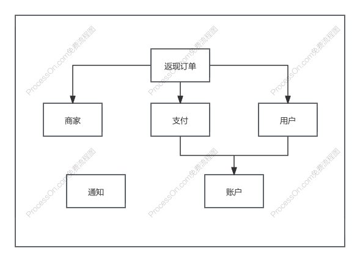

*依赖关系*

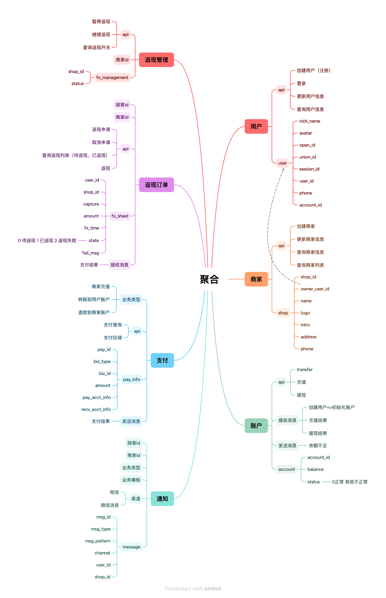
*聚合设计*

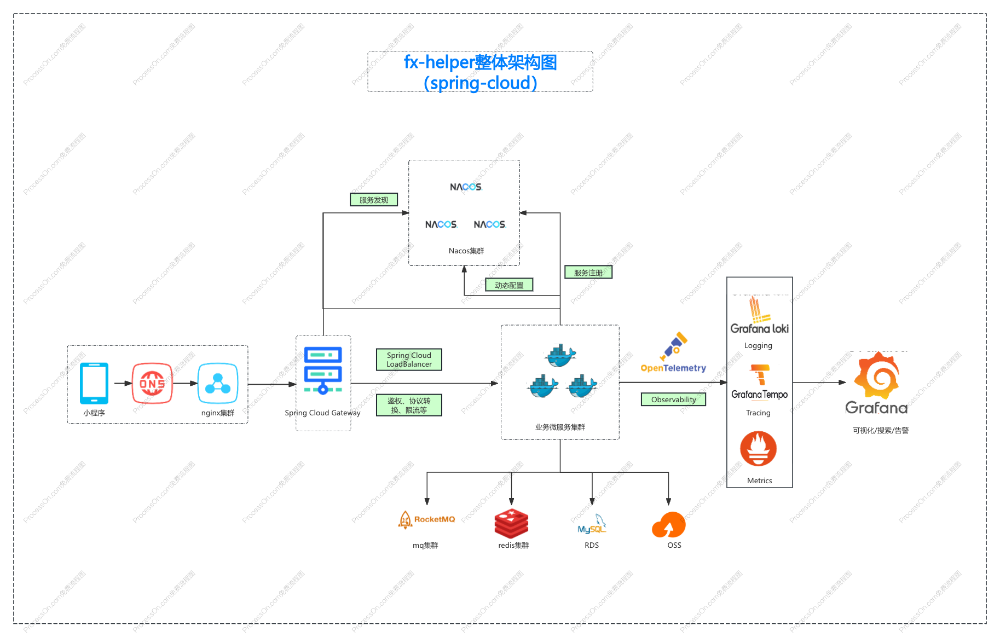
*整体架构*

## 代码实现

本项目未遵循`DDD`的推荐代码实现，实际上我认为`DDD`在业务分析和建模阶段有很高的实用价值和参考意义，但是在代码实现阶段就有点水土不服了。
`DDD`本质上是`OOP`在工程实践中的延伸，所以其核心思想是`OOP`，而`OOP`是不适合于`微服务`的（暴论！个人观点哈哈）。
因为微服务的复杂性在于服务拆分（这个阶段可以考虑`DDD`），在于服务治理，而单个微服务通常比较简单，用`OOP`是杀鸡用牛刀。
相较于`Responsibility-DD`/`Domain-DD`，`Data-DD`更符合大多数人的直觉，也更便于开发。

从团队的角度来看，`DDD`推荐的代码实现由于存在很多争议之处，导致每个人可能都有一套自己的代码风格，非常不利于团队协作和项目维护。
比如以下争议：
1. 领域服务 vs 聚合方法
2. 失血模型 vs 充血模型
3. dao vs  repository

本项目也没有使用六边形架构或者整洁架构等架构，因为虽然这些架构更加灵活，但也引入了更多的认知成本，而这些灵活性在绝大多数情况下是没必要的。
我们不会轻易更换开发框架，也不会轻易更换数据库等开发组件。况且就算真到了要换的时候，这些架构也并不能节省多少工作。

我认为这些架构只有在基础组件不断变化，或者交互方式不断变化的项目中才真的有价值。

正如我一直遵循的原则-奥卡姆剃刀：**若无必要，勿增实体**。 所以最终在代码架构上还是采用传统的MVC分层架构。

- 用户接口层：接收用户请求，解析请求参数，封装请求结果；
- 业务逻辑层：处理业务逻辑；
- 数据持久层：与数据库的交互逻辑；
- 除此之外，还有一些`util`、`manager`、`client`、`helper`、`builder`等通用功能类。

### 一些实现细节

- API风格
    - less is more
    - https://coolshell.cn/articles/22173.html
    - https://v2ex.com/t/830030
    - 放弃`RESTFUL` API ，原因与`DDD`一样，存在太多争议，定义模糊，实践困难，比如登录接口应该算是什么动词。
      除静态资源外全部使用`@PostMapping`，`@RequestBody` & `@ResponseBody` 。增删改查、业务功能用Api名称与文档去定义，而不是用`Http Method`的语义去定义。

- 参数传递
    - `Controller`是适配层，负责将通信协议中的数据转换成业务需要的数据，从而使`Service`层与通信协议解耦。
      所以`Service`层不应该出现诸如`HttpRequest`、`HttpHeader`等对象，但是可以有与通信协议无关的自定义`head`对象。
    - 在本项目中，原则上尽量少地使用`Cookie`/`Header`来传递信息，只在实现通用功能时使用，比如保持`Session`、版本管理等。
      需要传递一些业务通用、协议相关、客户端相关的信息时，使用`@RequestBody`内的"head"属性传递，比如`platform`等。
      之所以这样做是一：因为`HttpHeader`属于共享属性，不同的业务可能会有`Header`之间的冲突；二，`HttpHeader`是KV结构，不够结构化，使用起来不方便。

- 入参校验 : `bean validation` 2.0

- 统一异常处理 : `@ExceptionHandler` & `ErrorCode`

- i18n : `MessageSource` & `LocaleResolver`

- 会话
    - 从`HttpSession`获取用户信息，将用户信息放到`ThreadLocal`里，请求完成（`filter.doFilter`)后，remove。

- 权限
    - 简单起见，本项目不涉及复杂权限，只有两种用户，每种用户一种权限，所以省略权限管理。

- 事务消息
    - rocketmq事务性消息太过繁琐：[发送消息](https://github.com/apache/rocketmq-spring/blob/1be808da74764128e404ae33cbf5e97c248aa207/rocketmq-spring-boot-samples/rocketmq-produce-demo/src/main/java/org/apache/rocketmq/samples/springboot/ProducerApplication.java#L209
)、[本地事务、checkState](https://github.com/apache/rocketmq-spring/blob/1be808da74764128e404ae33cbf5e97c248aa207/rocketmq-spring-boot-samples/rocketmq-produce-demo/src/main/java/org/apache/rocketmq/samples/springboot/ProducerApplication.java#L246
)分割业务逻辑不说，也要多写很多代码，甚至还要改造业务表。
    - 所以我更倾向于使用本地消息表实现简单的事务消息，去哪儿的开源消息中间件qmq即使用此方案：自带本地消息表，事务消息会与本地事务一起提交，对业务基本零侵入。

    - 但在本项目使用rmq的情况下，只能使用业务方被动处理（分布式消息（retry+failover）） + 主动请求业务方（调用相关业务接口（retry+failover)）作为双保险， 来尽可能保证业务的正确性。
如果不能保证消息发送成功，那就一定要考虑好消息发送失败的后果，保证即使消息发送失败，业务也不会受太大影响。
在本项目中，发送用户创建消息是为了其他系统去创建该用户相关的其他信息，如果消息发送失败，也不会造成太大影响（无资损，也不会产生错误数据），只需将此消息重新发送即可修复。
因此，考虑到消息发送（+重试）失败是极小概率事件，可以不使用事务消息。

    - 除了使用消息外，还可以使用job去轮询数据状态，根据状态进行业务处理。
- client/api
    - 简单起见，将所有服务放在一个项目中（一般企业应用中，应当每个服务一个项目，每个项目都有很多模块，比如api/client、web、job等）;也将所有api/client放到一个一起，方便构建和理解。

### 可观测性

*Dashboard*

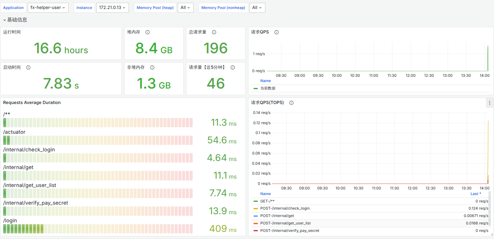

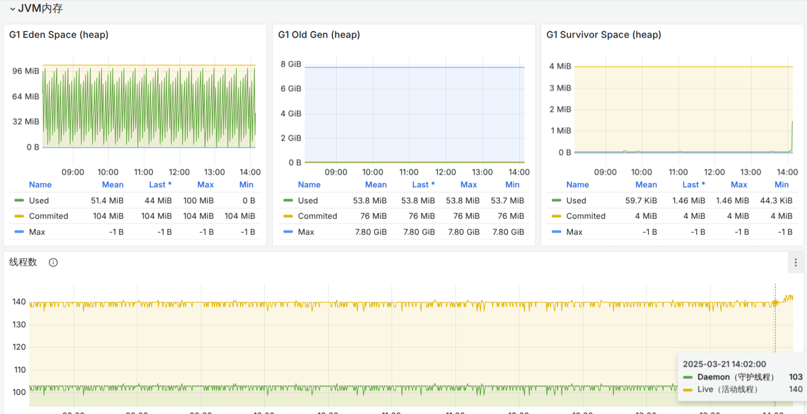
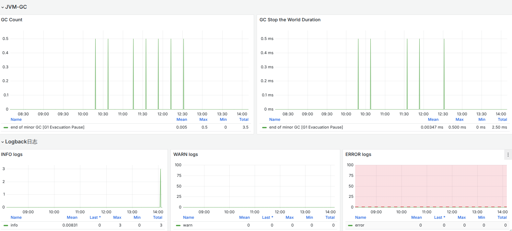

*Logging*

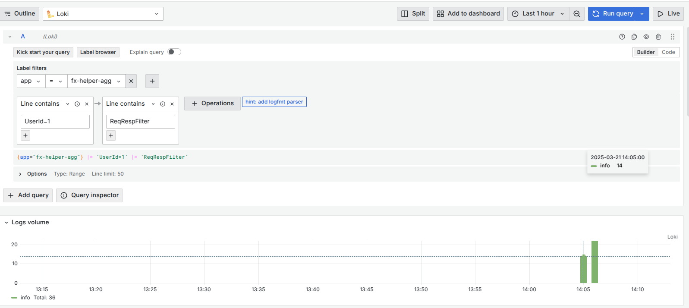
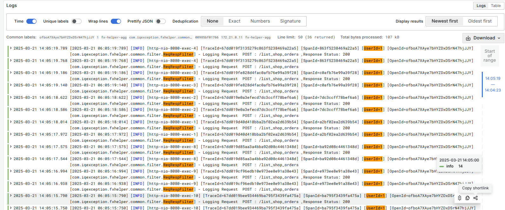
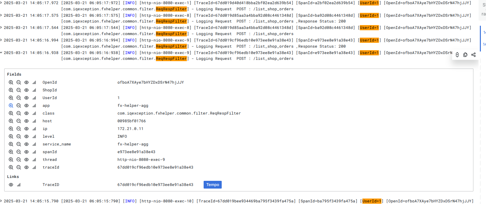

*Tracing*

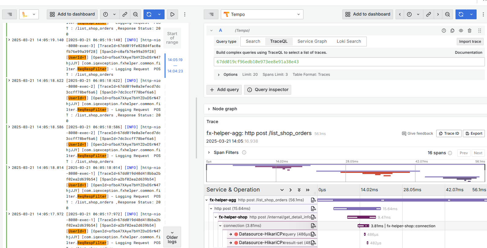
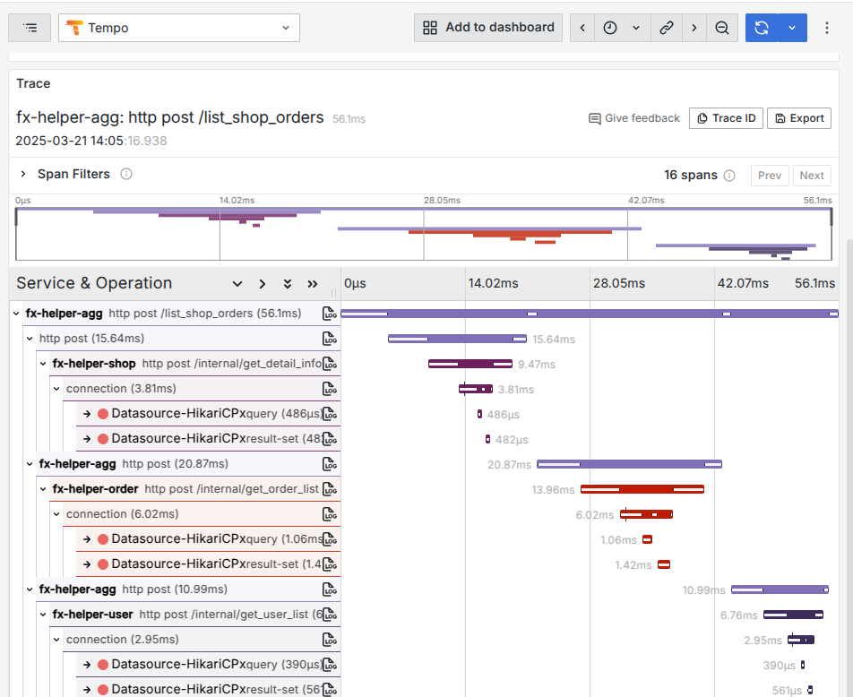

